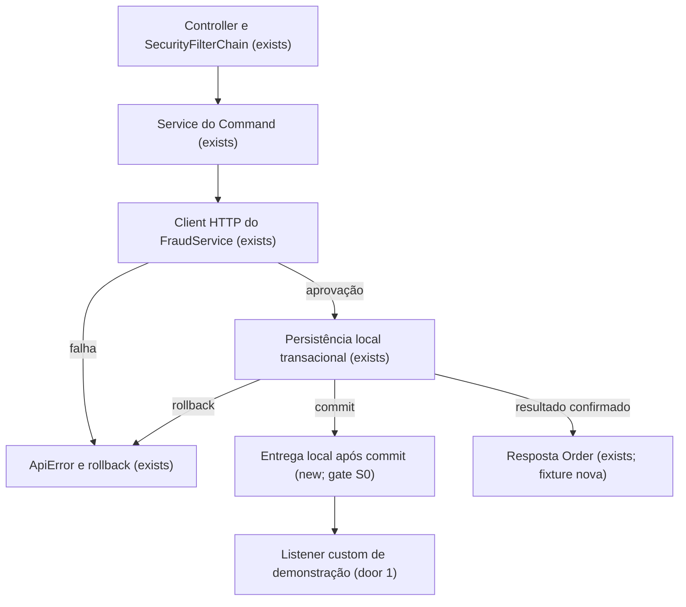
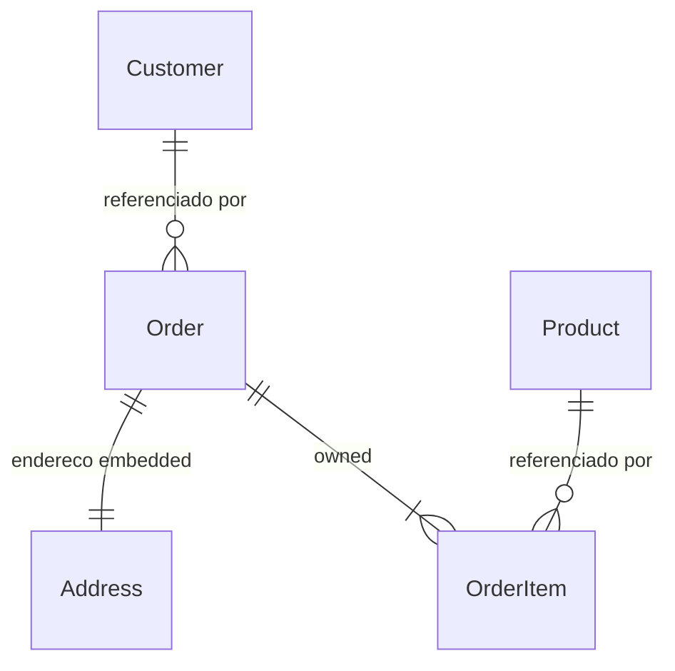

# Harpia — plano de desenvolvimento até concluir o MVP Core V1

Sources:

- [BACKLOG.md](../../../BACKLOG.md) — fonte oficial de escopo, IDs e critérios de conclusão.
- [Discovery](../../../.design/mvp-core-v1.md) — situação real, alternativas, riscos e gates técnicos.
- [Decisão AD-001](../../STATE.md) — custom dentro de `generated/`, confirmado pelo usuário.
- [Modelo solicitado](../../../.cursor/skills/tlc-spec-lean/references/plan.md) — estrutura, critérios EARS e revisão das superfícies.
- [FlowCallTest](../../../src/test/java/dev/harpia/validate/FlowCallTest.java), [SemanticValidator](../../../src/main/java/dev/harpia/validate/SemanticValidator.java) e [JavaSpringServiceTransformer](../../../src/main/java/dev/harpia/target/javaspring/transformer/JavaSpringServiceTransformer.java) — implementação e limites atuais.
- [GeneratedMavenProjectTest](../../../src/test/java/dev/harpia/target/javaspring/GeneratedMavenProjectTest.java), [CustomCodeOwnershipTest](../../../src/test/java/dev/harpia/emit/CustomCodeOwnershipTest.java) e [HandoffManifest](../../../src/main/java/dev/harpia/cli/HandoffManifest.java) — gates e contratos existentes.

Data: **2026-09-17**. Base inspecionada: **`3c62a18`**. Este é o plano completo até o Core; a implementação ainda não começou. As superfícies novas de S2–S5 só ficam prontas para construir depois do RFC/spike de S0. Os demais defaults são propostas explícitas para revisão.

## Problem

A Harpia já gera e empacota exemplos Java/Spring, mas ainda não demonstra a aplicação de complexidade intermediária que define o Core V1. O developer dispõe de capacidades isoladas sem uma prova única de domínio, composição, iteração, integração, evento, segurança e handoff. Sem essa prova, não existe evidência suficiente para encerrar o MVP e seguir o desenvolvimento da baseline em Java comum.

O backlog registra o objetivo de construção; não fornece métricas de uso ou prazo. A baseline executada nesta sessão passou em `mvn -o test`: **613 testes, 0 falhas, 0 erros, 0 ignorados**. Esse resultado valida os exemplos atuais, não a futura aplicação Commerce.

Ao concluir este plano, o developer consegue gerar o Commerce, executar seus testes e package, demonstrar seus fluxos com PostgreSQL e dependências locais de teste, receber um handoff verificável e continuar editando o projeto sem runtime Harpia obrigatório.

### Reconciliation of the current state

Há **14 registros canônicos abertos**, que se sobrepõem em algumas entregas. A recontagem é **213 Core = 199 DONE + 8 PARTIAL + 6 TODO**, incluindo o escape hatch custom. A tabela agregada de cobertura e o Top 10 estão desatualizados. Não se converte essa contagem em prontidão de produto.

| Registro aberto | Evidência / restante efetivo | Entrega |
| --- | --- | --- |
| CORE-010 | Logic tem escopos; faltam escopos e valores de Flow no recorte de iteração/composição | S1–S2 |
| FLOW-014 | Já há calls encadeados, Command e adapter custom; reconciliar contrato, execução e lacunas de composição | S1, S6 |
| FLOW-020 | `for each` ainda ausente | S2 |
| JAVA-004 | Operation nature atravessa IR; inputs, resultados e geração ainda guardam pressupostos CRUD | S0–S3 |
| CMD-008 | Política transacional ainda inferida; falta fechar contrato declarativo e composição | S3 |
| PERSIST-008 | Mesma entrega transacional de CMD-008, sem duplicar trabalho | S3 |
| RELY-001 | Timeout `2s`/`10s` e exceção da porta existem; faltam variantes nomeadas | S4 |
| FLOW-015 | Falta instrução de emissão | S5 |
| EVENT-003 | Mesma emissão tipada de FLOW-015 | S5 |
| EVENT-005 | Falta entrega local; dependência histórica de EVENT-004 precisa de reconciliação de recorte | S5 |
| SPRING-008 | Implementação Java/Spring da mesma entrega local | S5 |
| CUSTOM-002 | Injeção já aparece no código e em javac; completar execução com bean real e reconciliar status | S6 |
| CUSTOM-003 | Writer já preserva desconhecidos; layout agora escolhido, falta prova Maven/Spring e documentação | S6 |
| GREEN-003 | Falta baseline integrada; MSG-001 não deve trazer messaging distribuído para o Core | S7–S8 |

Reaproveitar como regressão: `INTEG-001/002/003/004/010`, `EVENT-001/007`, `SEC-002/003/005/007`, `API-008`, `SPRING-012`, `HARNESS-001` a `HARNESS-004`, `DOC-001`, domínio/relationships e gates já DONE. Não criar entregas para reimplementar esses itens.

## Out of scope

| Excluded | Why |
| --- | --- |
| Aggregate/Aggregate Root e ownership de aggregate (`DOM-015/016`) | Estão no Next; o exemplo usa Entity, Reference, Value e relationships owned existentes |
| Formula/Decision, Money/Currency, funções universais de coleções | Logic e Decimal bastam para a demonstração; não transformar o MVP em linguagem geral |
| Handler/On Event DSL (`EVENT-004`) e messaging geral (`MSG-001`) | Consumidor de demonstração é Java custom; emissão local atende o Core |
| Kafka/RabbitMQ, outbox, exactly-once e entrega durável | Não são gates do bootstrap; evento local não promete sobreviver a crash |
| Retry, circuit breaker, idempotência de negócio, locking e transações distribuídas | Explicitamente adiados; a unidade transacional do plano é o banco local |
| Rules nominais reutilizáveis de `RULE-004` | Ampliar leitura de valores no Flow apenas onde o Commerce exige; não fechar o item inteiro de Next |
| Query engine avançado, filtros opcionais, OpenAPI e evolução de schema | Preservar filtros de igualdade, ordenação/page e migration inicial |
| Plataforma de identidade, autorização por objeto e redaction geral | Provar JWT/ADMIN e configurações necessárias à fixture, sem ampliar security para o Next |
| Observabilidade avançada, cache, scheduling, workflow, multi-tenancy | Não bloqueiam os critérios oficiais do Core |
| Segundo target, MCP completo, brownfield e Managed Mode | O target `java-spring` e o harness existente atendem o produto solicitado |
| Deploy e infraestrutura de produção | A entrega é uma baseline local reproduzível e empacotada |

## Assumptions

| Assumption | Chosen default | Rationale | Confirmed? |
| --- | --- | --- | --- |
| Significado de MVP core | Harpia Core V1 e seus critérios finais no BACKLOG | Recorte explícito do pedido e do documento fonte | y |
| Layout custom | `generated/src/main/java/<pacote>/custom/`; contrato gerado em `logic` | Escolha explícita do usuário; AD-001 | y |
| Exemplo canônico | Criar `examples/commerce/`, mantendo Customer e ecommerce como regressão | Evita renomear contratos existentes de PurchaseOrder | n |
| Address | ValueObject embedded; OrderItem como Entity owned de Order | Exercita recursos existentes sem adicionar Aggregate | n |
| Stack da fixture | Java 21, `java-spring`, Spring Boot `3.4.4`, PostgreSQL | Essa versão Boot já é usada pelos testes offline de JWT, role e auth outbound; não é uma atualização global proposta | n |
| Negócio do exemplo | Order começa CREATED; CancelOrder muda para CANCELLED; nova tentativa responde 409 | Duas transições observáveis sem DSL de lifecycle | n |
| Segurança do exemplo | Create/Get/Search autenticados; Cancel exige ADMIN; JWT de teste tem `roles: ["ADMIN"]` | Exercita identidade e autorização combinadas; conversão é comprovada em S7 | n |
| Busca | `status` obrigatório; `page >= 0`; `1 <= size <= 100`; ordenação por id ascendente | Usa filtro de igualdade/page existentes sem adicionar filtros opcionais | n |
| Falha antifraude | Recusa de negócio 422; timeout/indisponibilidade/resposta inválida 503; sem retry | Diferencia decisão de negócio de dependência indisponível | n |
| Evento | Recomendar observação após commit, nenhuma em rollback, entrega local sem durabilidade | Proposta a resolver no RFC de S0 com o mecanismo correspondente | n |
| Iteração | Recomendar um nível de loop, ordem da coleção e escopo local; coleção iterada não pode ser alterada | Menor recorte que pode processar OrderItem; confirmar pelo spike/RFC | n |
| Transação | Recomendar Command obrigatório e Query read-only; chamadas aninhadas compartilham a transação | Atomicidade de pedido sem propagação/configuração universal; RFC de S0 fixa a sintaxe | n |
| Ambiente do gate final | PostgreSQL descartável, servidor HTTP/JWKS local e credenciais de teste | Não depender de FraudService ou provedor de identidade reais; runner ainda será preparado | n |
| Planejamento de prazo | Esforço relativo XS/S/M/L, sem datas prometidas | Capacidade da equipe não informada; recalibrar após S0 | n |

**Open questions:** TG-01–TG-04 abaixo. As decisões de produto não respondidas usam os defaults acima; custom já foi confirmado. As questões técnicas de alto impacto bloqueiam partes da implementação e estão explicitamente planejadas, sem bloquear a entrega deste roadmap.

### Technical gates

| Gate | Kind | Pergunta a resolver | Until answered |
| --- | --- | --- | --- |
| TG-01 | blocks | Qual extensão mínima de inputs, acesso a campos e resultados permite CreateOrder com itens owned? | S0 entrega spike e contrato; não fixar arquitetura de S1/S2/JAVA-004 antes disso |
| TG-02 | blocks | Quais são a sintaxe e a semântica exatas de loop, transação, mapping de falhas e emit? | S0 entrega RFC literal, exemplos aceitos/recusados e mecanismo; não publicar as novas superfícies de S2–S5 |
| TG-03 | blocks | JWT real com claim roles satisfaz ADMIN na aplicação gerada? | Prova delimitada em S7; GREEN-003 não fecha com testes que injetam Authentication artificialmente |
| TG-04 | blocks go-live | O runner do gate integrado fornece PostgreSQL e as fixtures HTTP/JWKS? | Preparar durante S7; não substituir por mocks de repository nem pular o gate final |

## Criteria

P0 identifica fechamento do Core, não a prioridade antiga de cada item DONE reutilizado. A numeração é única no plano. Os exemplos abaixo são propostas de contrato; S0 fixa sua sintaxe, sem diminuir os resultados observáveis exigidos.

### S0: demonstrar o recorte executável e resolver os contratos novos (P0)

**Acceptance Criteria**

1. WHEN a baseline for reconciliada THEN o registro de execução SHALL distinguir os 14 itens canônicos abertos dos comportamentos já implementados, com evidência de produção e teste para cada mudança de status proposta.
2. WHEN o spike mínimo de CreateOrder terminar THEN seu relatório SHALL mapear cada recusa de input, acesso a campo, resultado de Command e associação owned a uma extensão necessária para o Commerce ou a uma capacidade existente.
3. WHEN o RFC de S0 terminar THEN o registro `.design/mvp-core-v1-contracts.md` SHALL conter a forma literal, um exemplo válido, um exemplo recusado e o mecanismo de cada contrato novo de Flow, transação, falha outbound e evento.
4. IF uma dependência histórica promover Aggregate, Handler DSL ou messaging distribuído ao Core THEN o plano de execução SHALL registrar a correção de escopo no backlog antes de executar trabalho dessa dependência.

**Independent test:** ler o inventário contra os IDs canônicos e executar o menor exemplo do spike, observando suas recusas reais. O spike encerra ao responder TG-01/TG-02, sem implementar o Commerce inteiro. A saída resolve o recorte necessário para preparar os checks das próximas slices.

### S1: compor operações usando os valores produzidos pelo Flow (P0)

**Acceptance Criteria**

5. WHEN uma Logic produzir Decimal e uma chamada posterior usar esse resultado THEN o serviço gerado SHALL executar a segunda chamada com o valor da primeira, sem reler um input homônimo.
6. WHEN um Command interno for chamado com argumentos nomeados THEN o serviço gerado SHALL invocar o Command resolvido com os argumentos na ordem de sua assinatura.
7. WHEN `set`, `require`, `fail` ou `if` usar um valor local tipado já produzido THEN o Flow SHALL avaliar a expressão com o valor visível naquele ponto.
8. IF um nome for usado antes da declaração ou fora do bloco onde foi declarado THEN validate SHALL emitir diagnóstico com código registrado e range da referência inválida.
9. IF chamadas de Commands formarem um ciclo direto ou indireto THEN validate SHALL recusar o ciclo antes da geração de services.
10. IF uma Query chamar um Command ou emitir evento THEN validate SHALL recusar o efeito usando o contrato de Query sem mutação.
11. WHEN um Command explícito usar o input e o resultado aprovados em S0 além da forma CRUD original THEN build SHALL gerar Java compilável sem exigir campos persistidos artificiais apenas para aceitar o input.
12. WHEN os exemplos V0 existentes forem compilados THEN sua interpretação SHALL permanecer compatível com as fixtures de regressão, sem adquirir as construções exclusivas de V1.

**Independent test:** executar uma composição de duas Logics e um Command interno, consumir o resultado em uma guarda/atribuição e observar o resultado persistido. Exercitar nomes inválidos, ciclo entre Commands e Query com efeito. Os casos positivos já presentes em FlowCallTest são reaproveitados, não reimplementados.

### S2: processar os itens do pedido com iteração tipada (P0)

**Acceptance Criteria**

13. WHEN um loop receber uma coleção com N itens THEN o Flow SHALL executar seu corpo N vezes na ordem da coleção.
14. WHEN um loop receber uma coleção vazia THEN o Flow SHALL executar zero vezes seu corpo.
15. WHEN o corpo do loop ler um campo do item tipado THEN a expressão SHALL produzir o valor do campo declarado no tipo do item.
16. IF o corpo usar um campo inexistente ou incompatível com a assinatura chamada THEN validate SHALL emitir diagnóstico no acesso incompatível antes de gerar Java.
17. IF o item do loop ou uma variável declarada no corpo for referenciado depois do loop THEN validate SHALL recusar a referência fora de escopo.
18. IF houver loop aninhado, `break`, `continue`, iteração assíncrona ou alteração da própria coleção iterada THEN validate SHALL recusar a construção no recorte Core definido em S0.
19. WHEN o exemplo processar itens de totais 20.00 e 30.00 THEN o fluxo que chama CalculateTotal SHALL produzir total 50.00 em Decimal, sem conversão para ponto flutuante binário.

**Independent test:** processar zero, um e dois itens; comprovar ordem e total; testar referência que escapa do corpo. O acumulador usa estado permitido pelo contrato S0, sem introduzir uma biblioteca geral de operações sobre coleções.

### S3: executar o Command composto com atomicidade local (P0)

**Acceptance Criteria**

20. WHEN um Command declarar a política transacional aprovada em S0 THEN a Application IR SHALL preservar essa política explicitamente para o target.
21. WHEN um Command com Order e seus OrderItems terminar com sucesso THEN o banco SHALL confirmar todas as gravações dessa execução na mesma transação local.
22. IF um erro declarado ocorrer depois de uma gravação e antes do término do Command THEN o banco SHALL manter zero novas gravações daquela execução após o rollback.
23. WHEN um Command chamar outro Command THEN as gravações do chamado SHALL participar da transação do chamador, inclusive quando ambos pertencem ao mesmo service gerado.
24. WHEN uma Query for gerada THEN o método correspondente SHALL usar a política read-only aprovada em S0.
25. IF uma política declarada contrariar os efeitos validados da operação THEN validate SHALL recusar a operação antes de gerar o projeto.
26. IF uma chamada HTTP falhar durante o Command THEN o banco SHALL reverter as gravações locais realizadas por aquela execução.

**Independent test:** executar contra PostgreSQL real, provocar falha após a primeira gravação e consultar o banco por uma conexão posterior. A prova inclui chamada no mesmo service, onde self-invocation não cria um novo proxy. Não afirmar rollback de efeitos remotos.

### S4: consumir o antifraude e reconhecer suas falhas declaradas (P0)

**Acceptance Criteria**

27. WHEN o binding associar um status HTTP à variante declarada da Integration THEN o client gerado SHALL expor essa variante ao chamador quando receber esse status.
28. IF o binding nomear variante inexistente ou dois mappings conflitantes para o mesmo gatilho THEN validate SHALL recusar o mapping no seu arquivo de binding.
29. IF a resposta ultrapassar o read timeout configurado THEN a chamada SHALL terminar pela variante de timeout definida em S0.
30. IF a resposta violar o contrato obrigatório da porta THEN a chamada SHALL terminar pela variante de resposta inválida definida em S0.
31. WHEN FraudService retornar aprovação THEN CreateOrder SHALL usar a aprovação no prosseguimento do Flow.
32. IF FraudService retornar recusa de negócio THEN CreateOrder SHALL responder 422 usando `ApiError(status, error, message)`.
33. IF FraudService sofrer timeout, indisponibilidade ou resposta inválida THEN CreateOrder SHALL responder 503 usando `ApiError(status, error, message)`.

**Independent test:** servidor HTTP local controlado responde aprovação, recusa, timeout e corpo inválido; conferir variante, resposta pública e ausência de gravação confirmada. Preservar o RestClientCustomizer e os defaults connect/read de 2s/10s. Para timeout no teste, usar configuração curta e uma margem explícita, sem depender da rede externa.

### S5: emitir OrderCreated por um provider local (P0)

**Acceptance Criteria**

34. WHEN `emit` referenciar Event declarado com payload compatível THEN build SHALL gerar a publicação do record tipado correspondente.
35. IF o Event não existir ou seu payload omitir um campo obrigatório THEN validate SHALL recusar a emissão no ponto da instrução.
36. WHEN CreateOrder confirmar sua transação THEN o listener local de demonstração SHALL observar um OrderCreated para a única emissão executada naquele fluxo.
37. IF CreateOrder reverter sua transação THEN o listener local SHALL observar zero OrderCreated daquela execução.
38. WHEN a aplicação declarar Event sem executar `emit` THEN o target SHALL continuar gerando seu contrato sem exigir broker externo.
39. IF o listener de demonstração falhar após o commit THEN a política definida em S0 SHALL preservar o resultado já confirmado do Command e registrar a falha com o nome do evento.

**Independent test:** listener Java de teste registra os eventos recebidos após uma criação confirmada e após rollback. Exercitar falha do listener segundo o mecanismo escolhido no RFC. Uma publicação por instrução não é garantia de exactly-once entre retries; crash pode perder evento porque não há outbox.

### S6: continuar o desenvolvimento com uma implementação custom preservada (P0)

**Acceptance Criteria**

40. WHEN o developer fornecer um bean que implementa o contrato em `generated/src/main/java/<pacote>/custom/` THEN o service gerado SHALL invocar esse bean com a assinatura da Logic declarada.
41. WHEN o projeto com esse bean executar `mvn -o test` THEN Maven SHALL terminar com exit code 0 usando o source root convencional, sem plugin adicional de source roots.
42. WHEN build for repetido com `--clean --force` THEN o arquivo custom SHALL permanecer byte a byte igual ao escrito pelo developer.
43. WHEN o manifesto de ownership for escrito THEN ele SHALL excluir os arquivos custom que o compiler não gerou.
44. IF `--clean` for solicitado sem `--force` na presença de arquivo desconhecido THEN build SHALL preservar a recusa atual e o arquivo do usuário.
45. WHEN um contrato custom estiver declarado THEN o handoff SHALL listar a obrigação de fornecer seu bean e o layout escolhido, sem afirmar que analisou ou validou a implementação Java do usuário.

**Independent test:** fornecer um bean com resultado distinguível de qualquer implementação automática, subir o contexto, executar a operação e reconstruir duas vezes. Conferir bytes e manifesto. O exemplo versiona a implementação de demonstração fora do output descartável da fixture e a instala no caminho final durante o teste, como arquivo do usuário.

### S7: usar o Commerce Service completo (P0)

**Acceptance Criteria**

46. WHEN a especificação canônica for validada THEN o projeto SHALL resolver Customer, Address, Product, Order, OrderItem, CustomerTier, OrderStatus, CalculateDiscount, CalculateTotal, CreateOrder, CancelOrder, GetOrder, SearchOrders, FraudService e OrderCreated no mesmo pipeline.
47. WHEN CreateOrder receber pedido válido aprovado pelo antifraude THEN `POST /orders` SHALL responder 201 com a representação Order definida em Surface.
48. WHEN GetOrder receber o id de um pedido existente THEN `GET /orders/{id}` SHALL responder 200 com a representação persistida.
49. IF GetOrder ou CancelOrder receber id inexistente THEN a operação SHALL responder 404 no formato ApiError.
50. WHEN SearchOrders não encontrar pedidos para o status solicitado THEN `GET /orders` SHALL responder 200 com `content: []` e `totalElements: 0`.
51. WHEN SearchOrders receber página válida THEN o resultado SHALL seguir o envelope de paginação existente com ordenação por id ascendente.
52. IF `page < 0` ou `size` estiver fora de 1 a 100 THEN SearchOrders SHALL responder 400 no formato ApiError.
53. WHEN um JWT válido com role ADMIN solicitar CancelOrder para um pedido CREATED THEN `POST /orders/{id}/cancel` SHALL responder 200 com status CANCELLED persistido.
54. IF CancelOrder receber pedido já CANCELLED THEN a operação SHALL responder 409 no formato ApiError.
55. IF uma rota autenticada receber token ausente, expirado ou de assinatura inválida THEN a rota SHALL responder 401 no formato ApiError.
56. IF CancelOrder receber JWT válido sem role ADMIN THEN a rota SHALL responder 403 no formato ApiError.
57. WHEN os testes integrados executarem a aplicação gerada THEN a persistência SHALL usar PostgreSQL inicializado pela migration Flyway gerada, sem substituir repositories por mocks nessa prova.

**Independent test:** partir de um banco descartável, fixtures de Customer/Product e HTTP/JWKS locais, criar e consultar um pedido, buscar uma página vazia, cancelar como ADMIN e repetir com token inválido/sem role. Testes com token assinado realmente atravessam o decoder e a conversão de authorities. Isso complementa os testes unitários gerados.

### S8: entregar a baseline compilada, empacotada e documentada (P0)

**Acceptance Criteria**

58. WHEN o runner executar `validate → build → mvn test → mvn package` no Commerce THEN cada gate SHALL terminar com exit code 0 sem correção manual dos arquivos gerados.
59. WHEN duas gerações usarem os mesmos inputs THEN a árvore de arquivos de propriedade Harpia SHALL ter conteúdo idêntico, incluindo manifestos determinísticos.
60. WHEN o jar produzido pelo Commerce for inspecionado THEN ele SHALL conter o launcher Spring Boot, a Start-Class gerada e suas dependências de execução.
61. WHEN o runner iniciar o jar com as dependências locais de teste THEN a aplicação SHALL responder ao fluxo HTTP de demonstração sem carregar runtime Harpia.
62. WHEN build gerar `.harpia/handoff.json` THEN o manifesto SHALL distinguir validate/build executados pelo compiler de test/package pendentes para o executor externo.
63. IF um comando solicitado em JSON falhar por erro de compilação ou escrita THEN stdout SHALL conter um resultado JSON com `ok: false`, exitCode correspondente e diagnóstico da falha, sem resumo textual misturado.
64. WHEN as novas construções entrarem no catálogo THEN cada exemplo válido ou recusado SHALL ser exercitado pela verificação automática do catálogo.
65. WHEN o Core for declarado concluído THEN cada um dos 14 registros originalmente abertos SHALL ter status DONE com evidência compatível com seu recorte, e GREEN-003 SHALL apontar para o gate Commerce integrado.

**Independent test:** executar o runner do começo ao fim em workspace limpo com toolchain/cache preparados; comparar duas saídas, inspecionar e iniciar o jar, ler handoff e conferir todos os registros. Testar falha ao escrever o handoff para impedir um sucesso ou stdout vazio enganoso. O relatório do runner guarda os resultados Maven sem falsificar o manifesto que o compiler escreveu antes deles.

## Traceability

Status nesta tabela é o avanço da execução deste plano, não uma substituição do status canônico do backlog. Os critérios estão em `In checks`, desdobrados em [checks.md](checks.md); nenhum critério foi verificado para a futura aplicação apenas porque a baseline passou.

| ID | Slice | Criteria | Status |
| --- | --- | --- | --- |
| MVP-001 | S0 | 1, 2, 3, 4 | In checks |
| CORE-010 | S1, S2 | 7, 8, 15, 16, 17 | In checks |
| FLOW-014 | S1, S6 | 5, 6, 7, 8, 9, 40 | In checks |
| JAVA-004 | S0, S1, S3 | 2, 3, 6, 10, 11, 12, 20, 23, 24, 25 | In checks |
| FLOW-020 | S2 | 13, 14, 15, 16, 17, 18, 19 | In checks |
| CMD-008 | S3 | 20, 21, 22, 23, 24, 25, 26 | In checks |
| PERSIST-008 | S3 | 20, 21, 22, 23, 24, 25, 26 | In checks |
| RELY-001 | S4 | 27, 28, 29, 30, 31, 32, 33 | In checks |
| FLOW-015 | S5 | 34, 35 | In checks |
| EVENT-003 | S5 | 34, 35 | In checks |
| EVENT-005 | S5 | 36, 37, 38, 39 | In checks |
| SPRING-008 | S5 | 36, 37, 38, 39 | In checks |
| CUSTOM-002 | S6 | 40, 41 | In checks |
| CUSTOM-003 | S6 | 41, 42, 43, 44, 45 | In checks |
| GREEN-003 | S7, S8 | 46, 47, 48, 49, 50, 51, 52, 53, 54, 55, 56, 57, 58, 60, 61, 65 | In checks |
| HARNESS-002 | S8 | 63 | In checks |
| HARNESS-003 | S6, S8 | 45, 62 | In checks |
| HARNESS-004 | S8 | 58, 62 | In checks |
| DET-003 | S8 | 59 | In checks |
| DOC-001 | S8 | 64 | In checks |

`MVP-001` é um requisito de planejamento, não um novo item canônico. IDs já DONE aparecem apenas para rastrear sua extensão/regressão. Não somar requisitos sobrepostos como esforço adicional.

## Observable

| Surface | Decision | Landing |
| --- | --- | --- |
| API `POST /orders` | resposta de criação | AC 47; Surface define Order |
| API `POST /orders` | erros de input, duplicidade, fraude e dependência | AC 32–33; existing — ApiError e validação/unique já gerados; Surface fixa 400/409/422/503 |
| API `POST /orders` | quem pode chamar | AC 55; identidade autenticada, sem ownership por cliente no Core |
| API `POST /orders` | versionamento e rate limit | n/a — API nova da fixture; versionamento e throttling são Next |
| API `GET /orders/{id}` | resposta e ausente | AC 48–49 |
| API `GET /orders/{id}` | quem pode chamar | AC 55; usuário autenticado |
| API `GET /orders/{id}` | versionamento e rate limit | n/a — API nova da fixture; capacidades adiadas |
| API `GET /orders` | vazio, ordenação e envelope | AC 50–51 |
| API `GET /orders` | limites e erros | AC 52; existing — ApiError |
| API `GET /orders` | quem pode chamar | AC 55; usuário autenticado |
| API `GET /orders` | versionamento e rate limit | n/a — API nova da fixture; capacidades adiadas |
| API `POST /orders/{id}/cancel` | resposta e estado inválido | AC 53–54 |
| API `POST /orders/{id}/cancel` | quem pode chamar e recusas | AC 49, 55–56; ADMIN, 404/401/403 |
| API `POST /orders/{id}/cancel` | versionamento e rate limit | n/a — API nova da fixture; capacidades adiadas |
| Integration FraudService | falha, timeout, resposta e credencial | AC 27–33; existing — auth por binding e credential por environment |
| Integration FraudService | chamador, versionamento e rate limit | existing — uso pelo service gerado; n/a — sem publicação de API externa própria ou retry/throttling novo |
| DSL Flow | escopo, ordem, tipos e construções recusadas | AC 5–19; sintaxe fica no RFC S0 |
| DSL Flow | vazamento de efeito em Query | AC 10 |
| Event local | payload e momento de observação | AC 34–39; mecanismo exigido pelo RFC S0 |
| CLI validate/build/inspect | formato e verbosidade | existing — texto por padrão, JSON com `--json`; AC 63 para falhas |
| CLI validate/build/inspect | flags e defaults | existing — `--dir .`; validate `--quiet=false`; build `--clean=false`, `--force=false`; inspect `--stage` obrigatório; `--json=false` nos três |
| CLI targets | flags, defaults e saída | existing — argumento TARGET opcional; omitido lista todos; `--json=false` |
| CLI capabilities | flags, defaults e saída | existing — `--dir .`, `--json=false`; capacidades requeridas pelo projeto |
| CLI version | flags, defaults e saída | existing — comando sem opções próprias; imprime a versão do compiler |
| CLI | exit codes | existing — ExitCode: 0 sucesso, 1 compilação, 2 uso/I/O |
| CLI build | falha depois de escrita parcial | AC 63; registrar que saída pode existir, não marcar sucesso quando handoff falhou |
| Custom | descoberta, ausência e reconstrução | AC 40–45; obrigação de bean fica explícita no handoff |
| Handoff | estrutura, próximo passo e limites do que foi executado | AC 45, 62–63; existing — contract, target, capabilities, ownership, customContracts, gates, next |
| Catálogo/documentação | estrutura, tom, profundidade e próxima ação | AC 64; exemplos completos em linguagem direta, do validate ao Java após handoff |
| Backlog organizado | agrupamento, ordem, duplicatas e exceções | AC 1, 4, 65; horizonte Core, ordem por dependência, IDs únicos e Next fora do denominador |

As nove dimensões foram examinadas: bounds em S1/S2/S7; falha parcial em S3/S4/S8; determinismo e duplicatas de geração em S6/S8; autorização em S7; ordem em S2/S7; lifecycle em S3/S6/S7; dependência externa em S4; transições em S7; observação de falhas em S4/S5/S8. Idempotência de negócio, garantias entre requisições concorrentes, TTL e observabilidade avançada permanecem excluídas. Não usar ordenação de lista como prova de concorrência nem manifestos como prova de idempotência HTTP. O registro formal `## Swept`, com todos os nove destinos e números de checks, será criado apenas na próxima fase, em `checks.md`.

## Flow

Reutilizar os estágios que já existem. S0 decide a extensão mínima dos modelos; não criar um pipeline especial para o Commerce.

1. Specs/config/bindings entram em `HarpiaCompiler`, `SpecDiscovery`, `BindingDiscovery` e `ConfigLoader` (exists): leitura determinística e configuração validada.
2. `SpecParser`, `FlowBlockParser` e `SymbolTable` (exists): declarações e referências; S1/S2/S5 acrescentam apenas nós tipados aprovados em S0.
3. `LogicAnalyzer`, `SemanticValidator` e resolvers de binding (exists): escopos, efeitos, chamadas, payloads, transação e mapeamentos de falha.
4. `Resolver` e `ApplicationModelBuilder` (exists): Business IR e Application IR preservam significado sem vocabulário Spring; inspect acompanha cada construção.
5. `JavaSpringTarget`, transformers, `JavaSourceRenderer` e templates (exists): geração de domínio, operações, clients, segurança, evento, testes, configuração e Maven.
6. `OutputWriter` e `HandoffManifest` (exists): sincronização pelo manifesto, preservação custom conforme door 1 e contrato de gates pendentes.
7. `GeneratedMavenProjectTest` e família de testes de target (exists): ampliar a estratégia para Commerce; runner integrado (new, no door — placement per conventions) executa PostgreSQL/HTTP/JWKS, testes, package e inicialização do jar.
8. out: baseline Java editável; `CatalogTest` (exists) valida os exemplos publicados e `BACKLOG.md` recebe evidência dos itens fechados.

O runtime tem uma ramificação real entre confirmação e rollback; o mecanismo novo de evento é aprovado em S0 antes de S5:



## Relations

Relações propostas apenas para o Commerce novo; não há migração de dados de aplicações já geradas.



OrderItem pertence a um único Order por relationship owned; Address é valor embedded, sem tabela independente. Referências a Customer e Product preservam a semântica atual de `Reference`, sem prometer carregamento ou FK que ela não implemente. O mínimo de um item é validação de negócio da fixture, não inferência de uma constraint SQL a partir do diagrama. O pedido continua armazenado quando cancelado; excluir registros e política de retenção estão fora desta entrega. Nenhuma entidade nova do compiler é persistida.

## Surface

Assinaturas propostas da aplicação nova; os status explicitam o conjunto que a fase de checks deve cobrir. `ApiError` mantém `status`, `error`, `message`.

| Route | In | Out | Status |
| --- | --- | --- | --- |
| `POST /orders` | JWT; `customerId`, `orderNumber`, `shippingAddress`, `items` | Order ou ApiError | 201, 400, 401, 409, 422, 503 |
| `GET /orders/{id}` | JWT; `id` | Order ou ApiError | 200, 401, 404 |
| `GET /orders` | JWT; `status`, `page`, `size` | PageResponse de Order ou ApiError | 200, 400, 401 |
| `POST /orders/{id}/cancel` | JWT com ADMIN; `id` | Order ou ApiError | 200, 401, 403, 404, 409 |

Order expõe `id`, `customerId`, `orderNumber`, `shippingAddress`, `items`, `total` e `status`. Item expõe `productId`, `quantity` e `unitPrice`; Address é Value com os campos que a fixture declarar. PageResponse mantém `content`, `page`, `size`, `totalElements` e `totalPages`, como no target atual. O contrato exato do input complexo e a distinção entre representação de domínio e DTO são saídas obrigatórias de S0. Não publicar o exemplo com mapping implícito que ainda não atravesse o compiler. `orderNumber` unique conserva o caminho 409 já existente; input malformado usa 400; violação de regra de domínio usa 422.

Outras superfícies são contratos existentes ou dependem do RFC antes de serem publicadas:

- CLI: manter flags/defaults de Observable e exit codes **0/1/2**; nenhum novo comando é necessário.
- DSL: `call` existente permanece; forma literal de iteração, política transacional, `emit` e mapping de falhas só é adicionada depois de S0.
- Outbound: FraudService tem assinatura tipada e binding HTTP; aprovação/recusa podem usar resposta bem formada, enquanto falhas de transporte/contrato usam variantes. Status HTTP ficam no binding.
- Event: record `OrderCreated` com identidade do pedido e total; o RFC fixa a assinatura antes da geração do novo exemplo.
- Handoff: preservar envelope/versão existentes; custom informa contrato e localização; um novo campo consumível exige revisão explícita do contrato e fixture de API.

## Landing

| One-way door | Literal shape | Alternative rejected |
| --- | --- | --- |
| 1 — layout custom, confirmado em AD-001 | `generated/src/main/java/<pacote>/custom/`; interfaces em `<pacote>.logic`; implementação fora do manifesto | `custom/` irmão exigiria source root adicional e resolver o gate Maven offline; usuário escolheu o layout interno |
| 2 — ownership e limite da geração, contrato existente | Writer só controla caminhos do manifesto; `--clean --force` preserva desconhecidos; após handoff o projeto é developer-owned | Apagar/recriar output inteiro destruiria custom; merge ou engenharia reversa generalizados pertencem a Managed Mode |
| 3 — separação dos contratos, constraint existente | Spec = semântica; binding = HTTP; config = `java-spring`, providers e ambiente; Java `21` | Colocar HTTP/Spring nos IRs de negócio quebraria a fronteira já protegida por testes |
| 4 — harness existente | JSON mantém contrato versionado; `.harpia/handoff.json` marca gates externos como `pending` | Marcar Maven como `passed` dentro de build afirmaria uma execução que o compiler não fez |
| 5 — Flow: input próprio, valores locais e iteração (S0, RFC contrato 1) | `### Input` deixa de ser projeção obrigatória da entidade em `languageVersion: 1`; valor local visível da linha seguinte até o fim do bloco, para toda expressão; `x.campo` tipado; `for each <x> in <coleção>` de um nível, corpo com quatro espaços | Funções universais de coleção (`map`/`filter`/`sum`) resolveriam o total sem laço, mas transformam o recorte em linguagem funcional geral, cada função virando contrato público sem fim natural; laço por índice traz aritmética de limite para a spec |
| 6 — transação declarada (S0, RFC contrato 2) | `### Transaction` com `required` ou `read only`, opcional; ausente preserva o default atual; chamada aninhada participa da transação do chamador | Atributos de propagação por chamada (`requires new`, isolamento, timeout) dariam ao Core um vocabulário transacional inteiro para demonstrar a atomicidade de um pedido; continuar inferindo dos passos é o que os dois registros abertos pedem para deixar de ser implícito |
| 7 — falha outbound nomeada (S0, RFC contrato 3) | `### Failures` no binding, com gatilhos `status <código>`, `timeout`, `unavailable` e `invalid response` ligados a variantes de `#### Errors`; cada variante vira subclasse aninhada da exceção da porta | Um campo `variant` na exceção única obrigaria todo chamador a ramificar dentro do `catch`, sem verificação do compilador e com variante nova passando por um `switch` sem `default`; mapear falha na spec quebraria a fronteira do door 3 |
| 8 — evento local após commit (S0, RFC contrato 4) | `emit <Event>(campo = expressão)`; o publisher gerado adia a entrega para `afterCommit` quando há transação, publica na hora quando não há, e registra falha do listener nomeando o Event sem desfazer o resultado confirmado | Publicar no ponto do `emit` e deixar o commit por conta de `@TransactionalEventListener` põe a garantia na anotação que o usuário pode não escrever: um listener comum veria evento de transação que ainda pode reverter. Broker e outbox são Next |

As quatro portas novas foram fechadas por S0 em [`.design/mvp-core-v1-contracts.md`](../../../.design/mvp-core-v1-contracts.md), com gramática, política, mecanismo, exemplo recusado e alternativa rejeitada em cada uma, e são provadas pelo check C3. Decisões que alcançam próximas features também entram em `.specs/STATE.md`. Routes do Commerce são propostas novas e não alteram consumidores existentes.

**Pendência aberta por S0:** a entidade não pode se chamar `Order` sobre `database.vendor: postgres` — `HRP2016` recusa a tabela reservada antes da geração, e o achado está em [`.design/mvp-core-v1-spike.md`](../../../.design/mvp-core-v1-spike.md). Isso alcança a fixture nomeada em C51 e é decisão do usuário, não do spike.

## Impact

| Front | What changes |
| --- | --- |
| domain — Command | Continua operação com efeitos; composição deixa de depender somente de um formato CRUD. SemanticValidator, Resolver, ApplicationModelBuilder e transformers são consumidores a revisar |
| domain — Query | Continua leitura; validação precisa observar também efeitos transitivos de calls e emissão |
| domain — Flow variable | Passa a alimentar expressões posteriores e corpo de loop com escopo tipado; LogicAnalyzer, IRs, Inspector e JavaLogicWriter precisam concordar |
| domain — Event | Contrato já existente passa a ser emitido localmente; sem broker, consumer DSL ou promessa de entrega durável |
| domain — Integration error | Variante já declarada passa a ser reconhecida pelo binding e traduzida na borda da operação; preservar exceção da porta e evitar dependência Spring no core |
| domain — custom | Código dentro de generated pertence ao usuário quando não está no manifesto; generated com custom não pode ser tratado como diretório descartável |
| stored data | Apenas migration inicial do Commerce. Nenhum backfill, schema diff ou migração de aplicações existentes |
| compatibility | Preservar V0 e fixtures atuais; novos nós/contratos revisam golden de IR, source mapping e livro-razão de diagnósticos sem apagar evidência de regressão |
| testing | Expandir provas de execução, não apenas comparação de strings; manter testes gerados e adicionar o gate integrado da aplicação de referência |
| security | Provar conversão JWT → authorities ADMIN; não reinterpretar silently o access dos exemplos existentes |
| documentation | Atualizar catálogo, README, limites da DSL, instruções custom e evidências canônicas junto de cada entrega |
| workspace | A `.gitignore` já está modificada pelo usuário; não sobrescrever. Durante S6, revisar conscientemente exemplos ignorados para que custom de demonstração seja versionado fora do output descartável |

## Roadmap

Uma entrega é uma fatia demonstrável. A tabela indica dependências, não divide o trabalho por camada. Esforço é relativo; os quatro registros de evento e os dois de transação contam como entregas conjuntas.

| Ordem | Slice / entrega | Depende de | Esforço | Gate de saída |
| --- | --- | --- | --- | --- |
| 0 | S0 — baseline, spike Commerce e contratos literais | revisão deste plano | S | TG-01/TG-02 respondidos; novos contratos registrados antes de checks de implementação |
| 1 | S1 — calls e valores de Flow compostos | S0 | M | resultado anterior consumido, Command executado e recusas de escopo/ciclo/pureza provadas |
| 2 | S2 — itens do pedido em loop | S1 | L | zero/um/muitos, ordem, total Decimal e escopo local demonstrados |
| 3 | S3 — atomicidade local declarada | S1, contrato S0; usar S2 na prova do pedido | M | commit/rollback contra PostgreSQL, incluindo Command aninhado |
| 4 | S4 — antifraude com falhas nomeadas | S1, S3 para prova de rollback | M | variantes reconhecidas, resultado consumido e erros 422/503 públicos |
| 5 | S5 — evento local | S1, S3; contrato S0 | M | evento após sucesso, zero em rollback e política de listener exercitada |
| 6 | S6 — custom real e preservado | S1; AD-001 já resolvida | S | bean executado, Maven offline e rebuild preservando bytes |
| 7 | S7 — Commerce integrado | S2, S3, S4, S5, S6 | L | banco/Flyway, HTTP, JWT real/ADMIN, evento e custom na mesma aplicação |
| 8 | S8 — gates e encerramento | S7 | M | cadeia completa, determinismo, jar iniciado, catálogo e backlog atualizados |

Caminho estrutural: **S0 → S1 → S2/S3 → S4/S5 → S7 → S8**; S6 pode entrar logo após S1. Com um executor, usar a ordem da tabela. Com equipe, S4/S5/S6 só podem avançar em paralelo depois que os contratos compartilhados estiverem fixados. Isso não autoriza execução paralela de agentes nesta sessão.

A fixture Commerce começa no spike e ganha comportamento em cada slice; não deixar a primeira composição para S7. Não estimar conclusão por soma de checkboxes ou pela cobertura ponderada do backlog. Recalibrar esforço de S1/S2/JAVA-004 após S0; nenhuma data foi prometida.

### Execution and verification

Os critérios foram desdobrados em [checks.md](checks.md), com obrigações, provas específicas e Coverage. O usuário confirmou o perfil **standard** em 2026-09-17 (AD-002): a verificação recompõe a cobertura e exercita injeção de falhas por superfície de asserção. S0 continua obrigatório antes de fechar as novas superfícies de linguagem; fixar os resultados esperados não equivale a declarar TG-01/TG-02 resolvidos.

Cada slice percorre parsing, análise, IR/inspect, geração e execução quando aplicáveis. Critério com comportamento runtime precisa observar execução; Java compilável ou golden sozinho não prova transação, DI, autorização, evento ou timeout. Reutilizar testes existentes e acrescentar somente provas que fecham lacunas. Não marcar como testado um seletor planejado que ainda não existe.

Ao fechar um item, atualizar seu status/evidência e reconciliar cobertura, data, blockers e snapshot conforme o contrato de manutenção do backlog. `CORE-010` fecha no recorte V1 definido, não em toda linguagem futura; `FLOW-014` não exige features de Next; `CMD-008`/`PERSIST-008` não exigem transações distribuídas. As dependências de EVENT-005 e GREEN-003 devem refletir o provider local aprovado em S0, preservando os itens futuros no Next.

### Final completion gate

Esta sequência é uma especificação do runner a construir em S7/S8, **não uma execução já realizada**. Os comandos usam as opções existentes da CLI. O primeiro passo pressupõe JDK 21 e dependências/plugins Maven previamente presentes no cache; offline não significa ausência de preparação do ambiente.

```bash
# Raiz do repositório: testar e produzir a CLI.
mvn -o package

# Exemplo que será criado pelo plano.
java -jar target/harpia.jar validate --dir examples/commerce --json
java -jar target/harpia.jar build --dir examples/commerce --json

# Após instalar o custom de demonstração e preparar PostgreSQL/HTTP/JWKS locais.
mvn -o -f examples/commerce/generated/pom.xml test
mvn -o -f examples/commerce/generated/pom.xml package
```

O runner também deve gerar em dois diretórios temporários independentes, comparar bytes/manifestos, inspecionar o jar e iniciá-lo com as dependências de teste, exercitar os status de Surface, conferir `.harpia/handoff.json` e coletar evidência. Não executar `rm -rf generated` sobre uma árvore que contém custom do developer.

Core V1 termina quando **todos os critérios deste recorte passam, os 14 itens abertos estão fechados com evidência e os gates existentes continuam verdes**. Uma pendência real não vira DONE por documentação, por teste ignorado ou por reclassificação oportunista para Next. Mudança de escopo exige decisão explícita. O encerramento da implementação inclui a verificação independente prevista pela skill e seu relatório; este pedido termina com os artefatos de discovery e planejamento.
